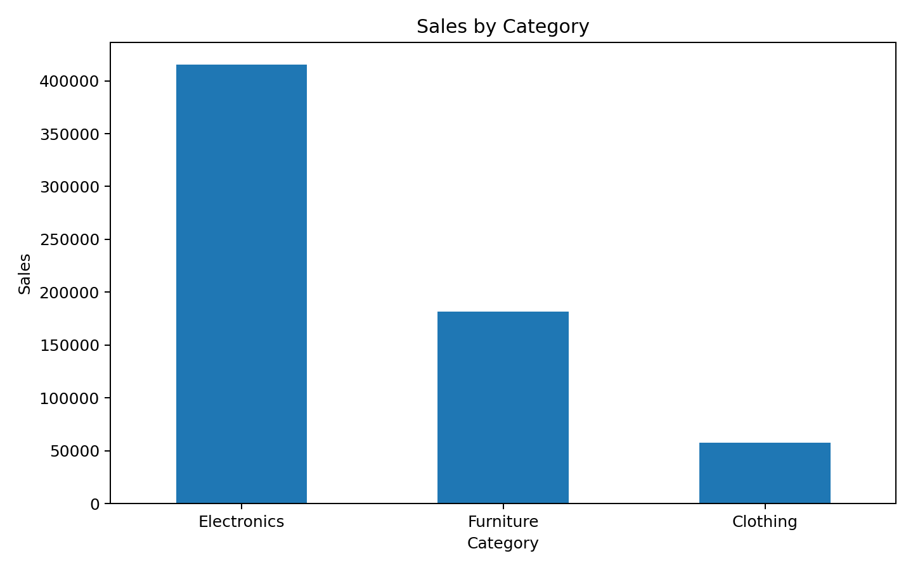
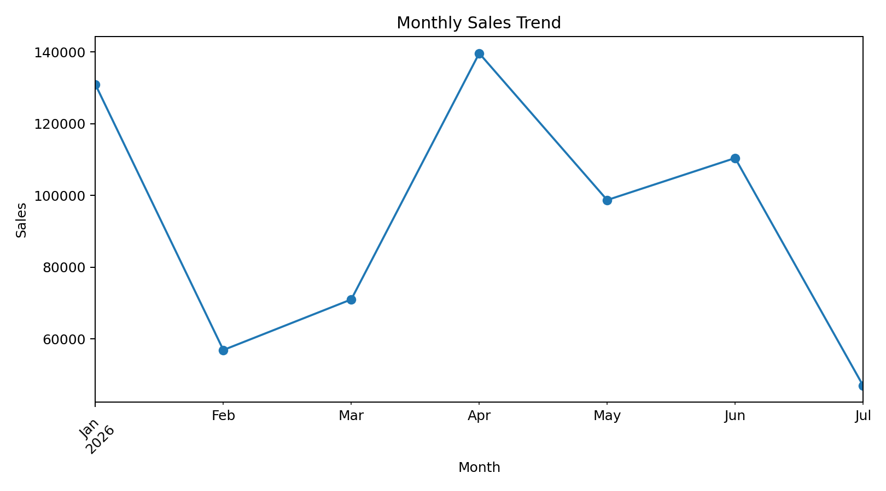

# E-Commerce Sales Analysis

## Project Overview

This project analyzes e-commerce sales data to identify sales performance, profit trends, top-selling products, category performance, and regional sales patterns.

The project uses SQL and Python to perform data analysis and create meaningful visualizations.

## Tools Used

- SQL
- Python
- Pandas
- Matplotlib
- GitHub

## Dataset

The dataset contains 30 e-commerce orders with the following columns:

- Order_ID
- Order_Date
- Customer_Name
- Category
- Product
- Region
- Quantity
- Unit_Price
- Sales
- Profit

## Key Performance Indicators

| KPI | Value |
|---|---:|
| Total Sales | ₹654,500 |
| Total Profit | ₹96,350 |
| Total Orders | 30 |
| Total Quantity Sold | 94 |

## Analysis Performed

- Total Sales Analysis
- Total Profit Analysis
- Total Orders Analysis
- Total Quantity Sold
- Category-wise Sales
- Region-wise Sales
- Product-wise Sales
- Category-wise Profit
- Monthly Sales Trend
- Top 5 Orders by Sales

## Visualizations

### Sales by Category



### Monthly Sales Trend



## Sales by Category

| Category | Sales |
|---|---:|
| Electronics | ₹415,400 |
| Furniture | ₹181,500 |
| Clothing | ₹57,600 |

## Sales by Region

| Region | Sales |
|---|---:|
| South | ₹346,600 |
| North | ₹125,500 |
| East | ₹109,900 |
| West | ₹72,500 |

## Top Products

| Product | Sales |
|---|---:|
| Laptop | ₹165,000 |
| Mobile | ₹110,000 |
| Monitor | ₹60,000 |
| Tablet | ₹54,000 |
| Sofa | ₹54,000 |

## Project Structure

```text
ecommerce-sales-analysis/
│
├── dataset/
│   └── ecommerce_sales.csv
│
├── sql/
│   └── analysis_queries.sql
│
├── python/
│   └── sales_analysis.py
│
├── category_sales.png
├── monthly_sales_trend.png
├── analysis_results.md
├── index.html
├── requirements.txt
├── LICENSE
├── README.md
└── .gitignore
